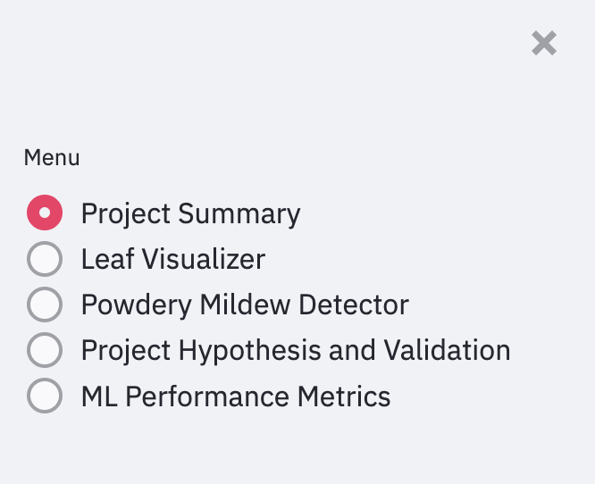
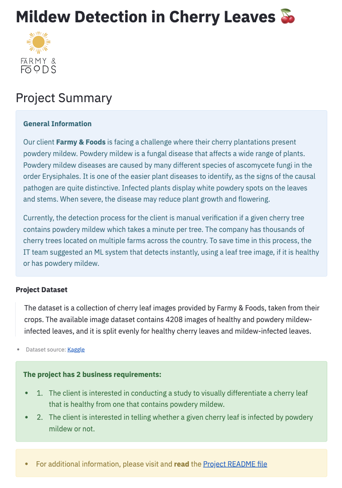
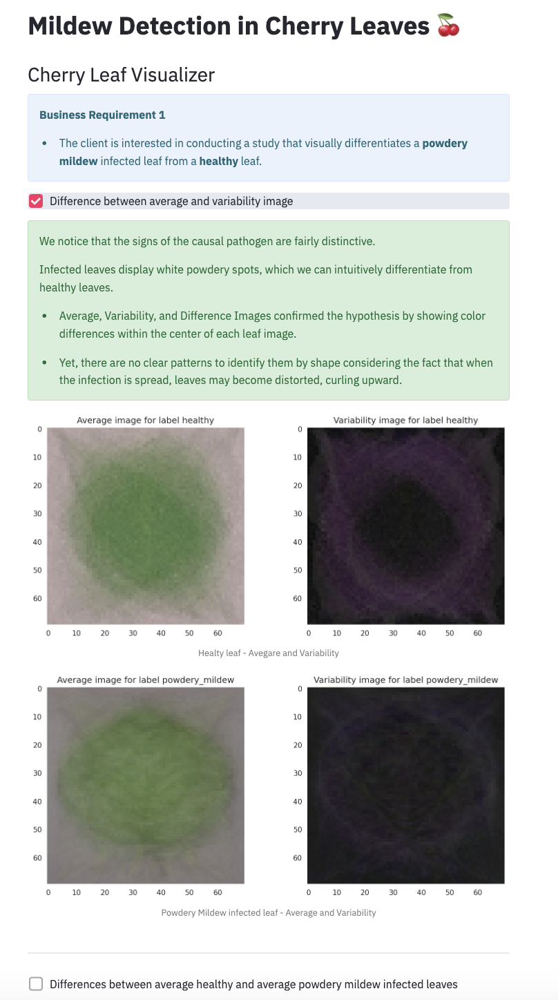
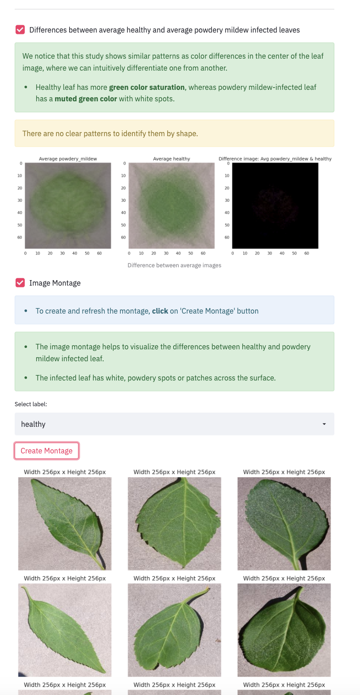
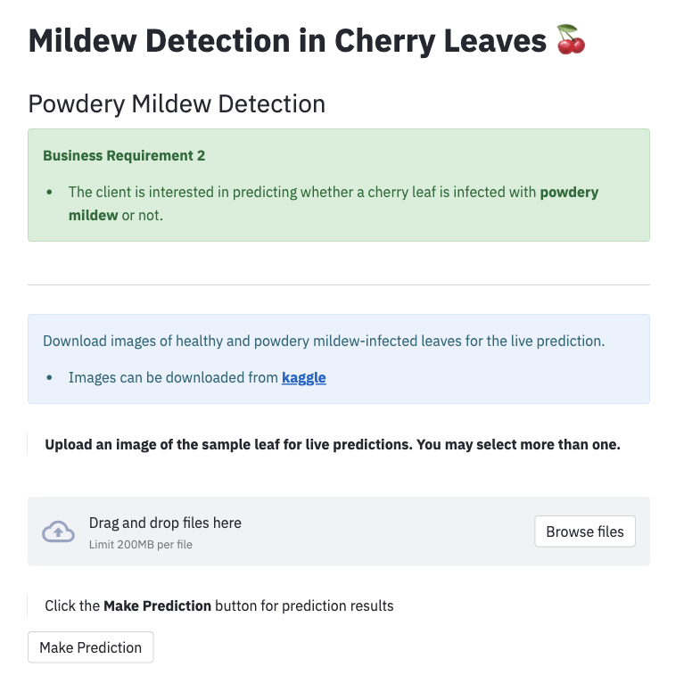
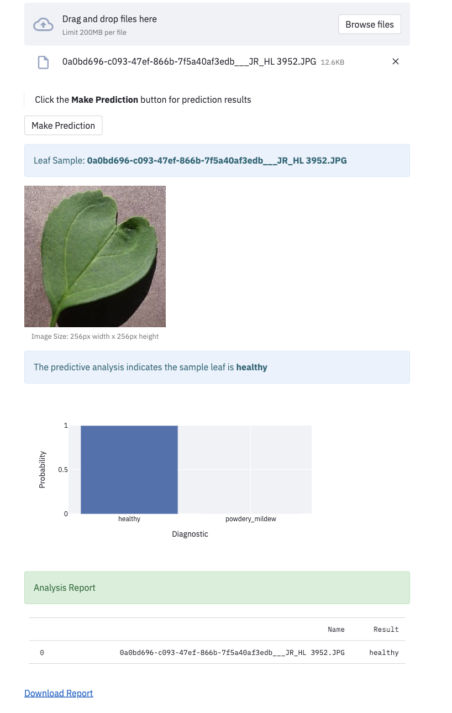
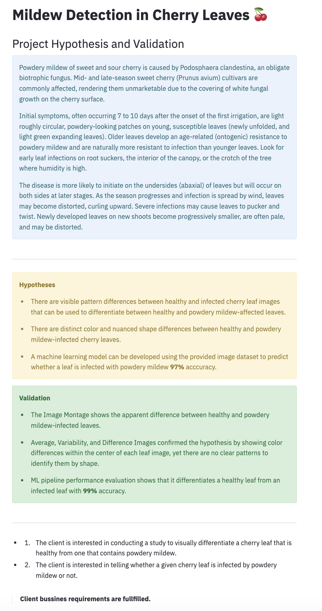
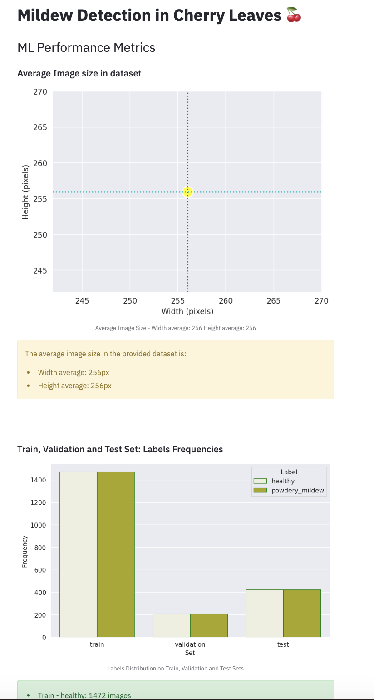
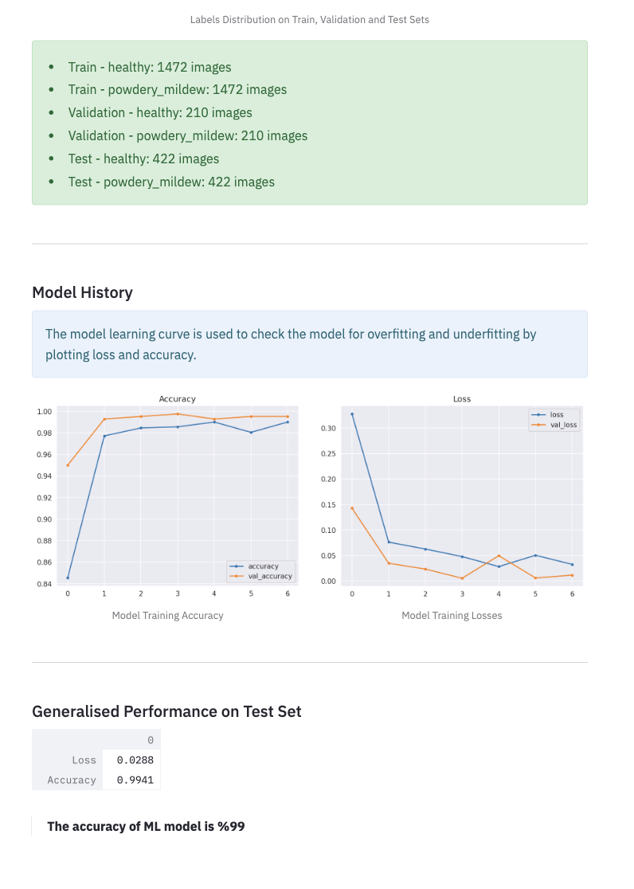

# 🌿🌿 **Mildew Detection in Cherry Leaves** 🌿🌿

The Mildew Detection application was created for the fictitious company Farmy & Foods, and uses ML technology to allow users to upload images of cherry leaves for analysis. It can predict whether a cherry leaf is healthy or infected with powdery mildew and provides a downloadable report summarizing the findings.

**Deployed version [Mildew Detection in Cherry Leaves](https://leaf-mildew-detection-93c6ae6d2d75.herokuapp.com/)**

## Table of Contents

- [Dataset Content](#dataset-content)
- [Business Requirements](#business-requirements)
- [Hypotheses and how to Validate](#hypotheses-and-how-to-validate)
    - [Hypotheses](#hypotheses)
    - [Validation](#validation)
- [Rationale to Map Business Requirements](#the-rationale-to-map-the-business-requirements-to-the-data-visualisations-and-ml-tasks)
    - [Business Requirement 1](#business-requirement-1)
    - [Business Requirement 2](#business-requirement-2)
- [Cross Industry Standard Process for Data Mining (CRISP-DM)](#cross-industry-standard-process-for-data-mining-crisp-dm)
- [ML Business Case](#ml-business-case)
    - [Business Case Assessment](#business-case-assessment)
    - [Actions to fulfill the business case](#actions-to-fulfill-the-business-case)
    - [Model Details](#model-details)
- [Dashboard Design](#dashboard-design)
- [Unfixed Bugs](#unfixed-bugs)
- [Deployment](#deployment)
    - [Heroku](#heroku)
    - [Forking the Repository](#forking-the-repository)
    - [Cloning the Repository](#cloning-the-repository)
- [Main Data Analysis and Machine Learning Libraries](#main-data-analysis-and-machine-learning-libraries)
    - [Languages](#languages)
    - [Frameworks, Libraries & Programs Used](#frameworks-libraries--programs-used)
- [Credits](#credits)
    - [Content](#content)
    - [Media](#media)
- [Acknowledgements](#acknowledgements)

## Dataset Content

- The dataset is sourced from [Kaggle](https://www.kaggle.com/codeinstitute/cherry-leaves). We then created a fictitious user story where predictive analytics can be applied in a real project in the workplace.

- The dataset contains +4 thousand images taken from the client's crop fields. The images show healthy cherry leaves and cherry leaves that have powdery mildew, a fungal disease that affects many plant species. The cherry plantation crop is one of the finest products in their portfolio, and the company is concerned about supplying the market with a compromised quality product.

## Business Requirements

The cherry plantation crop from Farmy & Foods is facing a challenge where their cherry plantations have been presenting powdery mildew. Currently, the process is manual verification if a given cherry tree contains powdery mildew. An employee spends around 30 minutes in each tree, taking a few samples of tree leaves and verifying visually if the leaf tree is healthy or has powdery mildew. If there is powdery mildew, the employee applies a specific compound to kill the fungus. The time spent applying this compound is 1 minute. The company has thousands of cherry trees located on multiple farms across the country. As a result, this manual process is not scalable due to the time spent in the manual process inspection.

To save time in this process, the IT team suggested an ML system that detects instantly, using a leaf tree image, if it is healthy or has powdery mildew. A similar manual process is in place for other crops for detecting pests, and if this initiative is successful, there is a realistic chance to replicate this project for all other crops. The dataset is a collection of cherry leaf images provided by Farmy & Foods, taken from their crops.

- 1 - The client is interested in conducting a study to visually differentiate a healthy cherry leaf from one with powdery mildew.
- 2 - The client is interested in predicting if a cherry leaf is healthy or contains powdery mildew.

## Hypotheses and how to validate?

### ***Hypotheses***

- There are visible pattern differences between healthy and infected cherry leaf images that can be used to differentiate between healthy and powdery mildew-affected leaves.

- There are distinct color and nuanced shape differences between healthy and powdery mildew-infected cherry leaves.

- A machine learning model can be developed using the provided image dataset to predict whether a leaf is infected with powdery mildew with minimum 97% acccuracy.

### ***Validation***

- The Image Montage shows the apparent difference between healthy and powdery mildew-infected leaves.

- Average, Variability, and Difference Images confirmed the hypothesis by showing color differences within the center of each leaf image, yet there are no clear patterns to identify them by shape.

- ML pipeline performance evaluation shows that it differentiates a healthy leaf from an infected leaf with 99% accuracy.

## The rationale to map the business requirements to the Data Visualisations and ML tasks

### ***Business Requirement 1:***

The client is interested in conducting a study to visually differentiate a healthy cherry leaf from one with powdery mildew.

> **Data Visualization**

- The dashboard will display the mean and standard deviation images for healthy and powdery mildew-infected cherry leaves.

- The contrast between an average healthy leaf and an average powdery mildew-infected leaf will be displayed.

- An image montage of healthy and powdery mildew-infected leaves will be presented.

### ***Business Requirement 2:***

The client is interested in predicting if a cherry leaf is healthy or contains powdery mildew.

> **Classification**

- Create a binary classifier ML model to predict whether a leaf is healthy or infected with powdery mildew. 

- Evaluate the performance of the Ml model for loss and accuracy.

- Create an option for users to generate and download a prediction report of uploadable images.

## Cross Industry Standard Process for Data Mining (CRISP-DM)

CRISP-DM was used while developing this project.

***1. Business understanding***

Business case assessment is provided by Code Institute.

> Business Requirement 1

Study should include analysis on:

- average images and variability images for each class (healthy or powdery mildew),
- the differences between average healthy and average powdery mildew cherry leaves,
- an image montage for each class

> Business Requirement 2:

- deliver an ML system that is capable of predicting whether a cherry leaf is healthy or contains powdery mildew

***2. Data Understanding***

The [Kaggle dataset](https://www.kaggle.com/datasets/codeinstitute/cherry-leaves) is provided by Code Institute over 4k images of healthy and affected cherry leaves.

- Data collection.

- Retrieve data from the Kaggle dataset  and save as raw data.

***3. Data Preparation***

- Clean data, check and remove non image files
- Split data into train validation and test set
- Set Image shape
- Average and variability of images per label
- Load image shapes and labels in an array
- Plot and save mean variability of images per label
- Difference between average healthy and powdery mildew contained leaf
- Image montage
- Image data augmentation

***4. Modelling***

- Create CNN model
- Fit created ML model with train set
- Save model

***5. Evaluation***

- Plot model learning curve for model training loss and accuracy
- Evaluate model on test set
- Load random image to predict
- Convert image to array and prepare for prediction.
- Predict class probabilities and evaluate.

***6. Deployment***

- Deploy the models into production environment.

## ML Business Case

### Business Case Assessment

- What are the business requirements?

    The client is interested in conducting a study to visually differentiate a cherry leaf that is healthy from one that contains powdery mildew.

    The client is interested in predicting if a cherry leaf is healthy or contains powdery mildew.

- Is there any business requirement that can be answered with conventional data analysis
    Yes, we can use conventional data analysis to conduct a study to visually differentiate a cherry leaf that is healthy from one that contains powdery mildew.

- Does the client need a dashboard or an API endpoint?

    The client needs a dashboard.

- What does the client consider as a successful project outcome?

    A study showing how to visually differentiate a cherry leaf that is healthy from one that contains powdery mildew.Also, the capability to predict if a cherry leaf is healthy or contains powdery mildew.
- Can you break down the project into Epics and User Stories?

    1. Information gathering and data collection.
    2. Data visualization, cleaning, and preparation.
    3. Model training, optimization and validation.
    4. Dashboard planning, designing, and development.
    5. Dashboard deployment and release.

- Ethical or Privacy concerns?

    The client provided the data under an NDA (non-disclosure agreement), therefore the data should only be shared with professionals that are officially involved in the project.

- Does the data suggest a particular model?

    The data suggests a binary classifier, indicating whether a particular cherry leaf is healthy or contains powdery mildew.

- What are the model's inputs and intended outputs?

    The input is a cherry leaf image and the output is a prediction of whether the cherry leaf is healthy or contains powdery mildew.

- What are the criteria for the performance goal of the predictions?

    We agreed with the client a degree of 97% accuracy.

- How will the client benefit?

    The client will not supply the market with a product of compromised quality.

---

### ***Actions to fulfill the business case***

> Using the dataset of images provided by client, build a supervised, binary classification ML model to predict if a leaf is healthy or infected with powdery mildew.

- **Data Collection:**

    Collect a image dataset of  healthy and powdery mildew-infected leaves.
- **Data Preprocessing:**

    Clean the non image files, check avarage image size, and split the data to train, validation and test sets.
- **Feature Extraction:**

    Use CNN to pull significant features from the images.
- **Model Selection:**

    Use CNN-based machine learning model for binary classification.
- **Model Training:**

    Train the model using the training set, and validate model performance with the validation set.
- **Model Evaluation:**

    Evaluate the trained model's performance with model learning curve and the validation set.
- **Model Testing:**

    Test the model's performance with different test datasets to evaluate its abstraction capability.

- **Deployment:**

    Deploy the trained model into production and incorporate it into an application where users can upload leaf images, get predictions, and download prediction reports.

---

### ***Model details***

- CNN model is used for image processing and designed for binary image classification.
- Sequential model arranges a sequence of layers in  neural network.
- Model has 4 convolutional layers and a dense layer with 128 neurons.
- Dropout layer and earlystopping is used to reduce the chance of overfitting the neural network.
- The output layer has one neuron with a sigmoid as the activation function.
- The loss function used is binary_crossentropy because it is a binary classification.
- The optimizer used is adam.

## Dashboard Design

1. ***Navigation***

- The navigation bar is accessible across all dashboard pages and is easy to use.

    

    
Navigation Image

    

    

---

2. ***Page 1: Project Summary***

- Farmy & Foods Logo - Image
- Project Summary - block of information
- Project Dataset - block of information
- Bussines requirements - block of information
- Link to the README file - block of information & hyperlink

    

    
Project Summary Page Image

    

    

---

3. ***Page 2: Leaf Visualizer***

- Business Requirement 1 - block of information

- Checkbox1 - Difference between average and variability image
    - A quick explanation of the data visualization result - block of information
    - Applicable image - image

- Checkbox2 - Differences between the average image of healthy and powdery mildew infected leaves

    - A quick explanation of the data visualization result - block of information
    - Another explanation of the data visualization result - block of information
    - Applicable image - image

- Checkbox3 - Image montage

    - Instruction for the user to click the "Create Montage" button - block of information
    - Image montage explanation - block of information
    - Select box - where the user can choose a label to create a montage
    - Create Montage button
    - The image montage of the selected label

        

        
Leaf Visualizer Page Image

        

        

        

---

4. ***Page 3: Powdery Mildew Detector***

- Business Requirement 2 - block of information
- Horizontal line
- Live prediction info and hyperlink to the download images of cherry leaves - block of information
- File uploader for users to upload cherry leaf images for  a diagnosis
    - Image Name - information block
    - Uploaded leaf sample - image
    - Diagnosis on the leaf sample - block of information
    - The diagnosis probability - barplot
    - Analysis report table for all uploaded images - data frame
    - Download report link

    

    
Powdery Mildew Detector Page Image

    

    

    

---

5. ***Page 4: Project Hypotheses and Validation***

- Powdery Mildew disease detailed explanation - block of information
- Horizontal line
- Hypotheses - block of information
- Validation - block of information
- Horizontal line
- Business Requirements - Text

    

    
Project Hypotheses and Validation Page Image

    

    

---

6. ***Page 5: ML Performance Metrics***

- Average Image size in dataset - image
- Average Image size in dataset - block of information
- Horizontal line
- Train, Validation and Test Set: Label Frequencies plot - image
- Train, Validation and Test Set: Label Frequencies - block of information
- Model History -  block of information
- Model History: Accuracy and Loss Line Graph - image
- Generalised Performance on Test Set - loss and accuracy performance metrics
- Model accuracy percentage - Text

    

    
ML Performance Metrics Image

    

    

    

---

## Unfixed Bugs

- No unfixed bugs.

## Deployment

### Heroku

- The App live link is: https://leaf-mildew-detection-93c6ae6d2d75.herokuapp.com/
- Set the runtime.txt Python version to a [Heroku-20](https://devcenter.heroku.com/articles/python-support#supported-runtimes) stack currently supported version.
- The project was deployed to Heroku using the following steps.

1. Log in to Heroku and create an App
2. At the Deploy tab, select GitHub as the deployment method.
3. Select your repository name and click Search. Once it is found, click Connect.
4. Select the branch you want to deploy, then click Deploy Branch.
5. The deployment process should happen smoothly if all deployment files are fully functional. Click the button Open App on the top of the page to access your App.
6. If the slug size is too large, then add large files not required for the app to the .slugignore file.

### Forking the Repository

- To create a copy of the repository, follow below steps:

1. Go the repository you want to fork.
2. Click the 'Fork' button located at the top right corner of the page.

### Cloning the Repository

- To clone the repository to your local machine, proceed as follows:

1. Go the repository you want to clone.
2. Click the green '<> Code' button and select your preferred cloning option from the list. Copy the provided link.
3. Open your terminal and navigate to the directory where you want to store the cloned repository.
4. Execute the command 'git clone' followed by the URL you copied earlier.
5. Press 'Enter' to create a local clone of the repository.

## Main Data Analysis and Machine Learning Libraries

### Languages

- Python

### Frameworks, Libraries & Programs Used

#### Numpy

- [NumPy](https://numpy.org/) was used for converting images into arrays to be fed to ML models. It is an open-source Python library used for working with arrays, matrices, and high-level mathematical functions.

#### Pandas

- [Pandas](https://pandas.pydata.org/) was used to manipulate and analyze the data. Pandas is a data manipulation and analysis library for Python, offering data structures and operations for manipulating numerical tables and time series data.

#### Matplotlib

- [Matplotlib](https://matplotlib.org/) was used to create charts and plots to visualize the data. It is a cross-platform, data visualization and graphical plotting library for Python.

#### Seaborn

- [Seaborn](https://seaborn.pydata.org/) was used for data visualization, built on top of Matplotlib, with additional high-level interfaces for drawing attractive and informative statistical graphics.

#### Plotly

- [Plotly](https://plotly.com/) was used to create interactive charts and plots. Plotly is a versatile graphing library that supports various chart types and provides interactivity features such as hover tooltips, zooming, and panning.

#### Streamlit

- [Streamlit](https://streamlit.io/) was used to create the project dashboard. It is an open-source app framework for building and sharing data-driven web applications quickly.

#### Scikit-learn

- [Scikit-learn](https://scikit-learn.org/stable/) was used as a base machine-learning library for the project. It is a powerful and easy-to-use library for machine learning in Python, offering tools for data preprocessing, feature extraction, model selection, and evaluation. It provided a consistent interface for implementing various machine learning algorithms and pipelines, facilitating the development and assessment of predictive models.

#### Tensorflow

- [Tensorflow](https://www.tensorflow.org/) was additional important ML library used for the project. It is an open-source deep learning framework developed by Google, offers comprehensive support for building and deploying machine learning models at scale. It provides low-level APIs for neural network development as well as high-level APIs through its Keras interface, enables to build and train complex neural network models efficiently.

#### Keras

- [Keras](https://keras.io/) was used as a high-level API for building neural networks for the project. It is a high-level, deep-learning API developed by Google for implementing neural networks. It maks the implementation of neural networks effortless and supports multiple backend neural network computations.

#### PIL

- [PIL](https://pypi.org/project/pillow/): Python Imaging Library is a free and open-source additional library for the Python programming language that adds support for opening, manipulating, and saving many different image file formats.

#### GitHub

- [GitHub](https://github.com/) was used as an online software development platform. It's used for storing, tracking, and collaborating on software projects.

#### Gitpod

- [Gitpod](https://www.gitpod.io/) was used as workspace environment for the project. It is a platform for automated and standardized development environments.

#### Kaggle

- [Kaggle](https://www.kaggle.com/): Kaggle was used as the primary source of image dataset.Kaggle is a data science competition platform and online community for data scientists and machine learning practitioners under Google LLC. It enables data scientists and other developers to engage in running machine learning contests, write and share code, and to host datasets.

#### Heroku

- [Heroku](https://www.heroku.com/what): Heroku was used to deploy the web application for the project. It is a cloud platform that lets companies build, deliver, monitor and scale apps.

## Credits

Study and reference materials

- https://docs.streamlit.io/1.13.0/develop/api-reference/text/st.code
- https://docs.streamlit.io/develop/api-reference#streamlit.set_page_config
- https://docs.streamlit.io/develop/api-reference/media/st.image
- https://matplotlib.org/stable/api/_as_gen/matplotlib.pyplot.bar.html
- https://matplotlib.org/stable/users/explain/colors/colors.html#colors-def
- https://seaborn.pydata.org/generated/seaborn.set_style.html#seaborn.set_style
- https://www.geeksforgeeks.org/choose-optimal-number-of-epochs-to-train-a-neural-network-in-keras/
- https://numpy.org/doc/stable/user/basics.creation.html
- https://github.com/SerraKD/WalkthroughProject01
- https://github.com/SerraKD/churnometer

### Content

- The powdery mildew information text for the Project summary page was taken from [Wikipedia](https://en.wikipedia.org/wiki/Powdery_mildew).

- The detailed explanation of powdery mildew disease taken from [Washington State University Tree Fruit](https://treefruit.wsu.edu/crop-protection/disease-management/cherry-powdery-mildew/#:~:text=Powdery%20mildew%20of%20sweet%20and,1).

- The Malaria Detector project code has been used as the study and reference material - [Malaria Detector](https://learn.codeinstitute.net/courses/course-v1:code_institute+CI_DA_ML+2021_Q4/courseware/07a3964f7a72407ea3e073542a2955bd/29ae4b4c67ed45a8a97bb9f4dcfa714b/).

- The Churnometer project provided by Code Institute has been the code that was used to learn the concepts used in this project. -
[Churnometer](https://learn.codeinstitute.net/courses/course-v1:CodeInstitute+DDA101+2021_T4/courseware/bba260bd5cc14e998b0d7e9b305d50ec/c83c55ea9f6c4e11969591e1b99c6c35/).

- Plant Disease Detection Using Deep learning by Anjaneya Teja Kalvakolanu was used as study material for better understanding of ML performance regarding to plant desease detection. - [Plant Disease Detection Using Deep learning](https://arxiv.org/pdf/2003.05379v1)

### Media

- The images used in this project are from the cherry-leaves kaggle dataset provided by [CI cherry_leaves](https://www.kaggle.com/datasets/codeinstitute/cherry-leaves).

- The company logo was created with [Looka](https://looka.com/).

- Responsive mockup image created with [Am I responsive?](https://ui.dev/amiresponsive).

- CRISP-DM image is taken from [Medium](https://medium.com/@yennhi95zz/6-the-deployment-phase-of-the-crisp-dm-methodology-a-detailed-discussion-f802a7cb9a0f).

## Acknowledgements

- My mentor Precious Ijege for support and guidance.

- Code Institute Slack Channel

---

**[Back to top](https://github.com/SerraKD/mildew-detection?tab=readme-ov-file#-mildew-detection-in-cherry-leaves-)**
